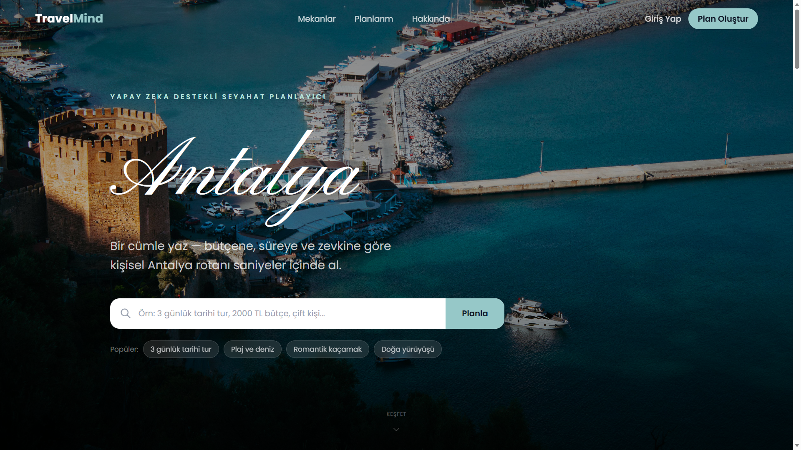
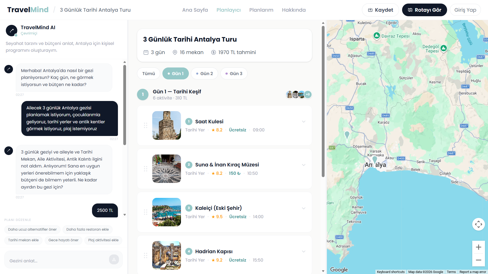
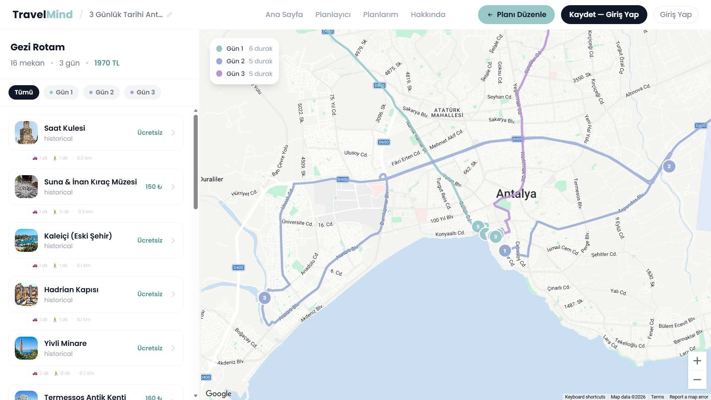

# TravelMind — Yapay Zeka Destekli Seyahat Planlayıcı

Kullanıcının doğal dilde yazdığı tek bir cümleye göre (bütçe, gün sayısı, ilgi alanları) kişiselleştirilmiş, gün gün optimize edilmiş bir Antalya gezi planı oluşturan yapay zeka destekli bir seyahat planlayıcı.

Bu proje, [Bilge Zerda Keklik](https://github.com/bilgez) tarafından bir ekip arkadaşıyla birlikte geliştirilen bir bitirme projesidir.

## Ekran Görüntüleri

### Ana Sayfa


### Sohbet Tabanlı Planlayıcı
Kullanıcı bütçe, süre ve ilgi alanlarını doğal dille yazıyor; sistem gün gün bir program oluşturuyor.


### Harita Üzerinde Optimize Rota
Her gün ayrı renkte, mekanlar arası mesafe ve süre bilgisiyle birlikte haritada gösteriliyor.


### Otomatik Rota Optimizasyonu


## Özellikler

- **Doğal dil ile planlama** — "3 günlük tarihi tur, 2000 TL bütçe, çift kişi" gibi tek bir cümleden yola çıkarak plan oluşturma
- **Yapay zeka destekli öneri sistemi** — bütçe, süre ve ilgi alanına göre mekan önerisi
- **Otomatik rota optimizasyonu** — günlük programı coğrafi olarak en verimli sırayla düzenleme
- **Google Maps entegrasyonu** — rotayı ve durakları harita üzerinde görselleştirme
- **JWT tabanlı kullanıcı hesapları** — planları kaydetme ve sonradan düzenleme
- **65 gerçek Antalya mekanı** — tarihi yerler, plajlar, restoranlar, doğa noktaları ve daha fazlası, kategorilere ayrılmış veri seti

## Teknolojiler

**Backend:** FastAPI · PostgreSQL · SQLAlchemy · JWT (python-jose) · Docker
**Frontend:** React (Vite) · Tailwind CSS · Google Maps API · Framer Motion
**Makine Öğrenmesi:** scikit-learn tabanlı öneri modeli
**Altyapı:** Docker Compose ile tam konteynerleştirilmiş geliştirme ortamı (backend + PostgreSQL + frontend)

## Ekip Katkısı

| Kişi | Katkı |
| **Zehra Timurağaoğlu** |
| **Bilge Zerda Keklik** | Backend geliştirme (FastAPI, veritabanı tasarımı), frontend geliştirme (React), mekan veri setinin oluşturulması ve düzenlenmesi, ML modelinin backend'e entegrasyonu |
| Ekip arkadaşım | Öneri sisteminin makine öğrenmesi modelinin eğitilmesi |

## Proje Yapısı

```
travelmind/
├── backend/          # FastAPI uygulaması
│   ├── models/        # SQLAlchemy modelleri
│   ├── routes/         # API endpoint'leri
│   ├── services/      # İş mantığı
│   ├── nlp/            # Doğal dil işleme / öneri mantığı
│   └── data/            # Mekan veri seti (JSON)
├── frontend/         # React (Vite) uygulaması
│   └── src/
│       ├── components/
│       ├── pages/
│       └── api/
└── docker-compose.yml
```

## Yerel Kurulum

Docker ile:

```bash
git clone https://github.com/bilgez/travelmind.git
cd travelmind
docker-compose up --build
```

Backend `http://localhost:8000`, frontend `http://localhost:5173` adresinde çalışır.

---

*Bu proje üniversite bitirme projesi olarak geliştirilmiştir.*